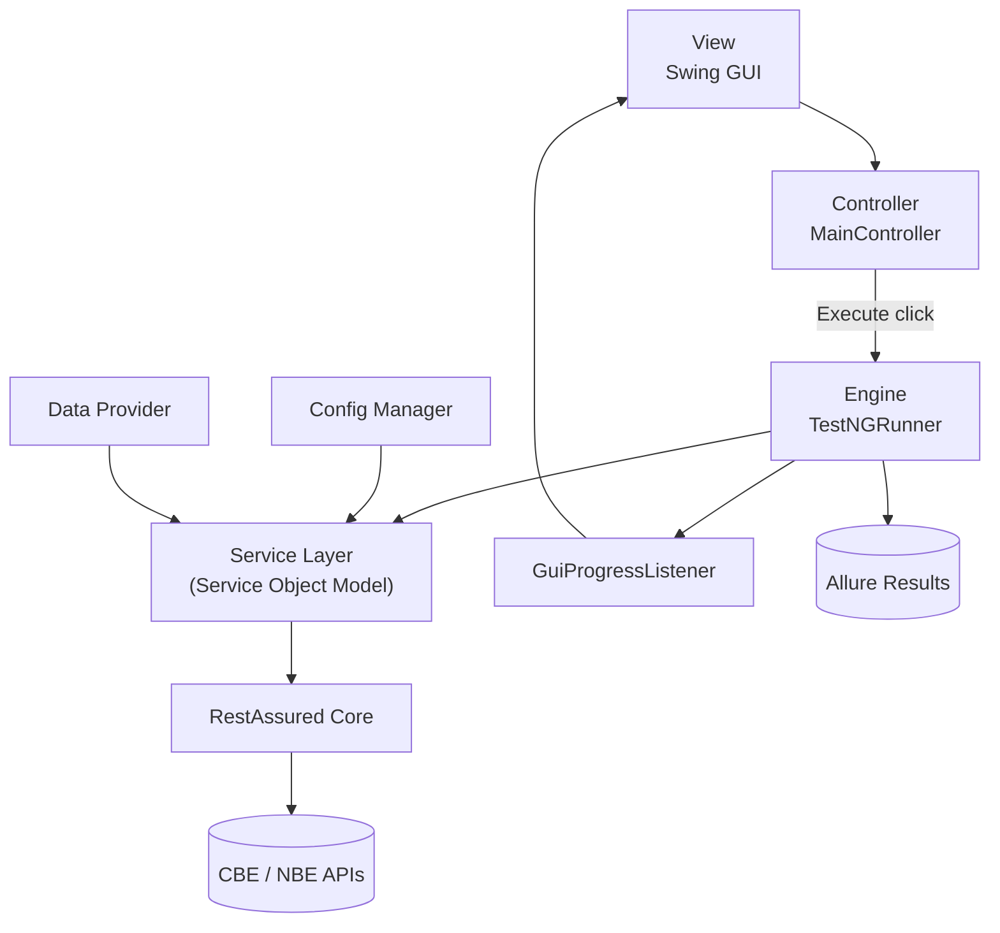
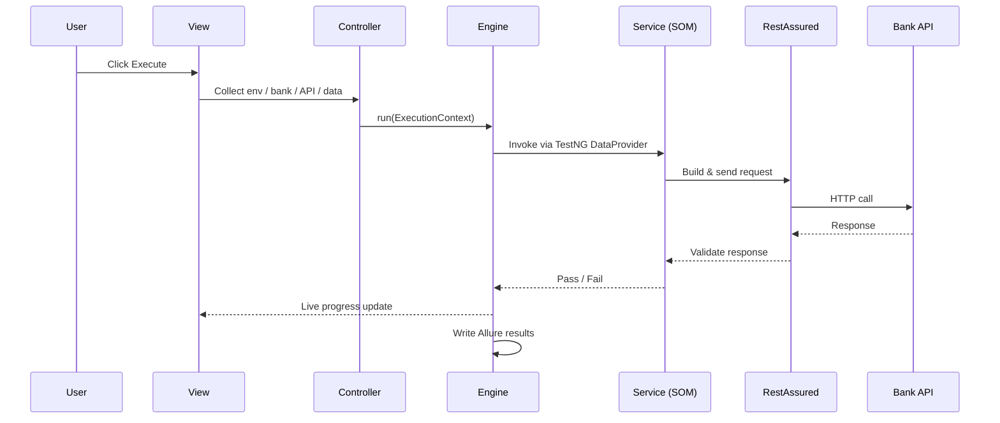

# RestRunner [ REST Assured GUI Test Runner Framework ]
**RestRunner** is a desktop-based API test execution framework built with **Java Swing** and powered by **REST Assured**. It provides an interactive desktop user interface to configure, trigger, monitor, and visualize API test executions without relying on third-party software.

## Project GUI

API Test Automation Framework
REST Assured API testing engine with a Swing GUI runner, built on MVC (UI) + Service Object Model (API layer).

---
Architecture

Execution Flow

